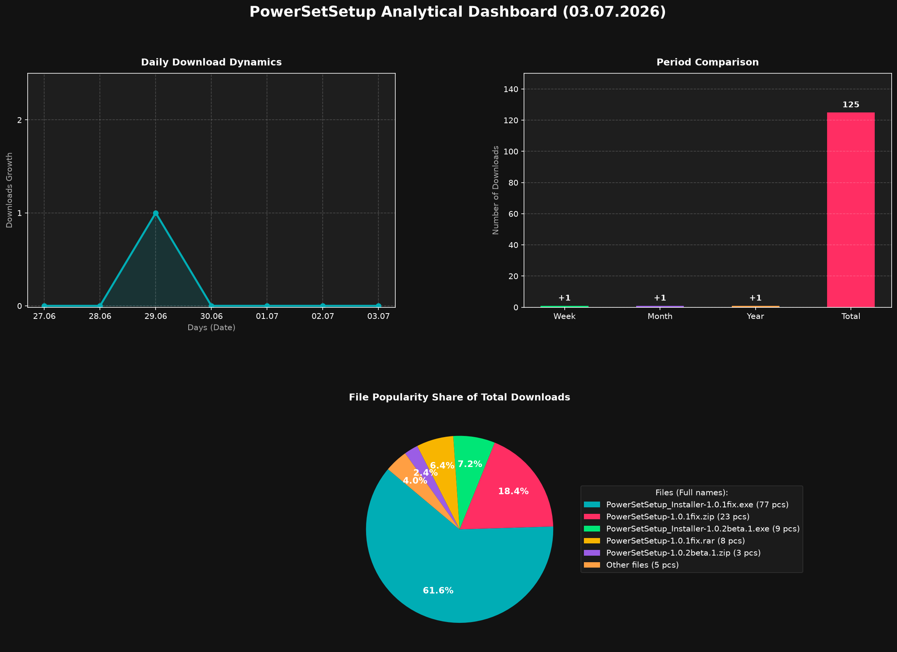
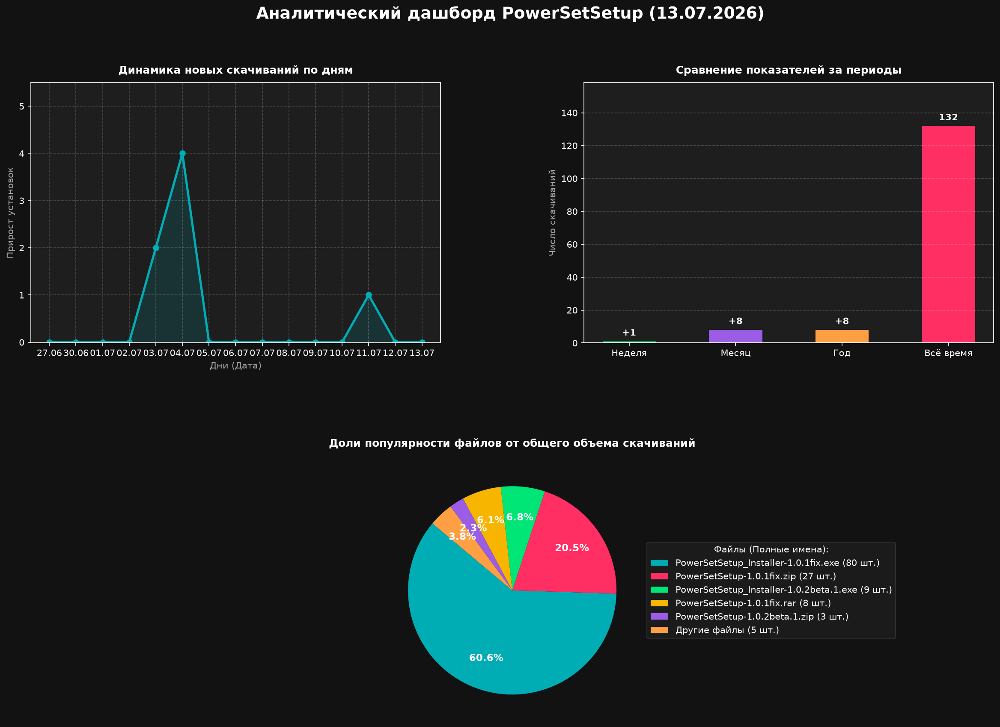

# PowerSetSetup ⚡

[Language: English](#english) | [Language: Русский](#русский)

---

## English

## 🧭 Quick Navigation

<picture>
  <source media="(prefers-color-scheme: dark)" srcset="stats/stats_dashboard_en_dark.png">
  <source media="(prefers-color-scheme: light)" srcset="stats/stats_dashboard_en_light.png">
  
</picture>

Updated every hour...

## 📖 Description

**PowerSetSetup** is a powerful Windows utility designed to manage power settings on **Windows 10 and Windows 11** operating systems. With an intuitive interface, you can easily perform various operations with power schemes including:

- 🔄 **Activating** power schemes
- 🗑️ **Deleting** unwanted power plans  
- 🔄 **Resetting** to default settings
- 🔍 **Retrieving** power scheme IDs
- ⚙️ **Optimizing** power consumption

> **Copyright © 2025-2026 BrocatScript. All rights reserved.**

---

## 🚀 Installation

### Quick Install

1. **▶** Download `PowerSetSetup_installer.exe`
2. **📁** Select your preferred installation path
3. **⏳** Wait for the installation to complete
4. **✅** Launch and configure your power settings

---

## ⚠️ Important Notes

| Warning | Description |
|---------|-------------|
| 🔄 | **Create a system restore point** before making changes |
| 💻 | **Close resource-intensive applications** during installation |
| 🪟 | **Requires Windows 10/11** - not compatible with older versions |
| 🛡️ | **Temporarily disable third-party antiviruses** if installation fails |

---

## 📜 License

**Full license:** [PolyForm Noncommercial License](https://github.com/BrocatScript/PowerSetSetup/blob/main/LICENSE.md)

---

## 🛠️ Technical Support

### Troubleshooting Steps

1. **🛡️** Disable third-party antivirus software temporarily
2. **🎮** Close all resource-intensive programs
3. **🔁** Ensure you're running Windows 10 or 11
4. **📧** Contact support if issues persist
5. **📬** Contact the Author: **Email** [brocatscript.support@gmail.com](mailto:brocatscript.support@gmail.com)

---

## 💝 Support the Author

If you find this tool useful, consider supporting the development:

---

## 📞 Contact

For questions, suggestions, or collaboration:

**Email:** [brocatscript.support@gmail.com](mailto:brocatscript.support@gmail.com)

---

**Made with ❤️ by BrocatScript**

*Optimize your Windows power management experience*

---

[Language: English](#english) | [Language: Русский](#русский)

## Русский

## 🧭 Быстрая Навигация

<picture>
  <source media="(prefers-color-scheme: dark)" srcset="stats/stats_dashboard_ru_dark.png">
  <source media="(prefers-color-scheme: light)" srcset="stats/stats_dashboard_ru_light.png">
  
</picture>

Обновление каждый час...

## 📖 Описание

**PowerSetSetup** это мощная утилита для Windows, предназначенная для управления параметрами электропитания в операционных системах **Windows 10 и Windows 11**. Благодаря интуитивно понятному интерфейсу вы можете легко выполнять различные операции со схемами электропитания, в том числе:

- 🔄 **Активация** схем электропитания
- 🗑️ **Удаление** ненужных планов электропитания
- 🔄 **Сброс** до заводских настроек
- 🔍 **Получение** идентификаторов схем электропитания
- ⚙️ **Оптимизация** энергопотребления

> **Copyright © 2025-2026 BrocatScript. All rights reserved.**

---

## 🚀 Установка

### Быстрая установка

1. **▶** Скачайте `PowerSetSetup_installer.exe`
2. **📁** Выберите предпочтительный путь установки
3. **⏳** Дождитесь завершения установки
4. **✅** Запустите и настройте параметры электропитания

---

## ⚠️ Важные примечания

| Предупреждение | Описание |
|---------|-------------|
| 🔄 | **Создайте точку восстановления системы** перед внесением изменений |
| 💻 | **Закройте ресурсоемкие приложения** во время настройки |
| 🪟 | **Требуется Windows 10/11** — не совместимо с более ранними версиями |
| 🛡️ | **Временно отключите сторонние антивирусы**, если установка не выполняется |

---

## 📜 Лицензия

**Полный вариант лицензии:** [PolyForm Noncommercial License](https://github.com/BrocatScript/PowerSetSetup/blob/main/LICENSE.md)

---

## 🛠️ Техническая Поддержка

### Действия по устранению неполадок

1. **🛡️** Временно отключите антивирусное программное обеспечение
2. **🎮** Закройте все ресурсоемкие программы
3. **🔁** Убедитесь, что у вас установлена Windows 10 или 11
4. **📧** Обратитесь в службу поддержки, если проблема не устранена
5. **📬** Свяжитесь с автором: **Почта** [brocatscript.support@gmail.com](mailto:brocatscript.support@gmail.com)

---

## 💝 Поддержите автора

Если вам понравился этот инструмент, подумайте о том, чтобы поддержать его разработку:

---

## 📞 Связь

По вопросам, предложениям или для совместной работы:

**Почта:** [brocatscript.support@gmail.com](mailto:brocatscript.support@gmail.com)

---

**Сделано с ❤️ BrocatScript**

*Оптимизируйте своё электропитание Windows*

